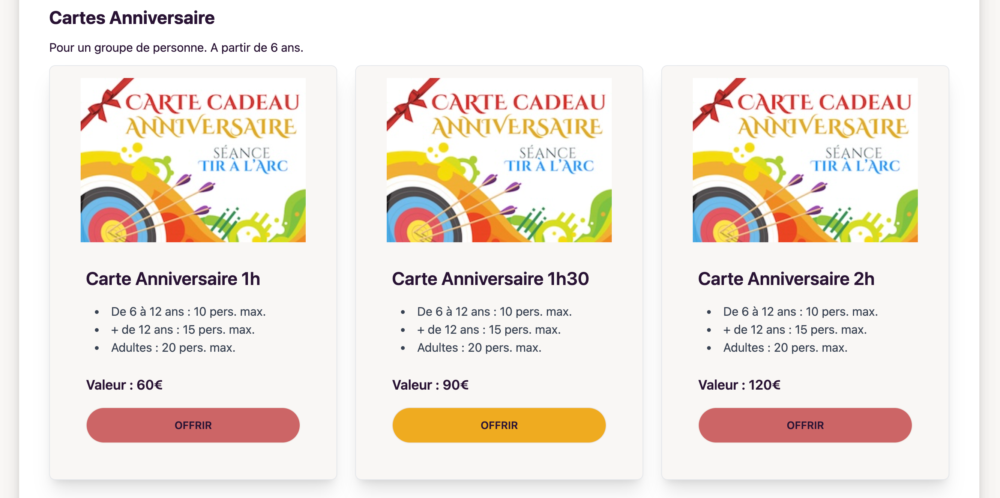

# Vue.js Project


## Description

Un projet Vue.js moderne utilisant les technologies suivantes :

- **Vue.js** - Framework JavaScript progressif
- **Tailwind CSS** - Framework CSS utility-first
- **DaisyUI** - Composants UI pour Tailwind CSS
- **Font Awesome** - Bibliothèque d'icônes
- **Node.js** - Environnement d'exécution JavaScript côté serveur
- **Express** - Framework web minimaliste pour Node.js
- **MongoDB** - Base de données NoSQL

## Fonctionnalités

- Module de réservation de créneau en ligne avec sélection de date via **datepicker**
- Affichage ou blocage de certaines dates dans le **datepicker** selon des données dynamiques (ex : dates déjà réservées ou indisponibles)
- Envoi automatique d'un email de confirmation après réservation
  

- Achat en ligne de cartes cadeaux avec paiement via **PayPal**
- Génération dynamique des boutons PayPal via l'API
  

### FrontEnd

- Vue.js 3
- Tailwind CSS
- DaisyUI
- Font Awesome

### BackEnd

- NodeJs
- Express
- MongoDb

## Installation

```bash
# Cloner le repository
git clone <url-du-repository>

# Installer les dépendances
npm install

# Lancer le serveur de développement
npm run dev
```

## Scripts disponibles

```bash
# Développement
npm run dev

# Build de production
npm run build

# Prévisualisation du build
npm run preview
```

## Structure du projet

```
src/
├── components/     # Composants Vue
├── views/         # Pages/Vues
├── assets/        # Assets statiques
├── router/        # Configuration du routeur
└── main.js        # Point d'entrée de l'application
```

## Licence

Ce projet est sous licence privée. Tous droits réservés.

## 👨‍💻 Auteur

Sandrine Fialon

- https://www.fialons-web.fr/
- Linkedin : https://www.linkedin.com/in/fialonsandrine/
